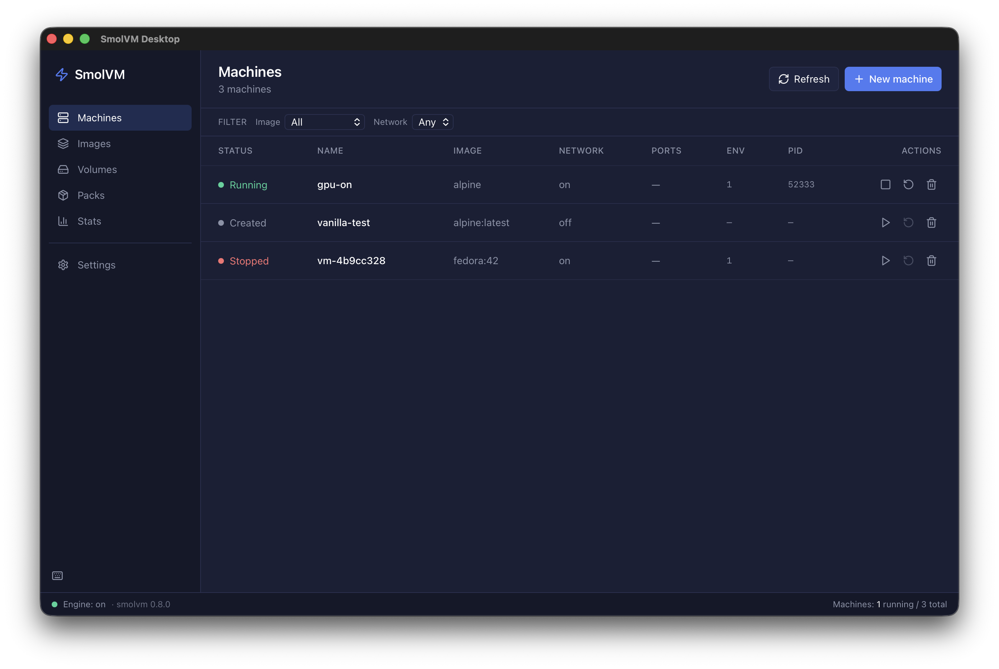

<p align="center">
  
</p>

<h1 align="center">SmolVM Desktop</h1>

<p align="center">
  A graphical front-end for <a href="https://github.com/smol-machines/smolvm">smolvm</a>, the local Linux VM tool.
</p>

---

<p align="center">
  
</p>

Create and run machines through a form instead of `smolvm machine create --image ... --cpus ...`. Browse files inside a running VM, watch CPU and memory, edit registries, build and install packs, and persist restart and health policies — all without leaving the window.

### What's inside

- **Machines** — start, stop, create, delete, and inspect persistent VMs, or fire off a one-shot `run -d`.
- **Files** — inspect the guest filesystem of any running machine.
- **Exec** — run shell commands inside a VM and stream output back live.
- **Images & Packs** — browse pulled OCI images, build `.smolmachine` packs, install them on another host.
- **Volumes** — see persistent volumes and which machines reference them.
- **Stats** — per-machine and host CPU / memory, with a small dashboard.
- **Settings** — registry config, smolvm binary override, polling interval, destructive-action confirmations.
- **Restart & health policies** — authored at create time, persisted via generated Smolfiles, honored when `smolvm machine monitor` is running.

### Requirements

- **[smolvm](https://github.com/smol-machines/smolvm) installed and on `PATH`.** This app shells out to it for every operation. If it isn't found, the Settings page lets you point at a specific binary.
- **macOS 11+, Linux (glibc-based, with WebKit2GTK 4.1), or Windows 10+** with [WebView2](https://developer.microsoft.com/en-us/microsoft-edge/webview2/) installed.

## Install

We aren't shipping signed prebuilt binaries yet, so for now the app needs to be built from source. This takes about 5–10 minutes on a first build and produces a normal native installer for your OS.

### Prerequisites

1. **Rust** — [rustup.rs](https://rustup.rs).
2. **Bun** — `curl -fsSL https://bun.sh/install | bash` (or see [bun.sh](https://bun.sh)).
3. **Platform-specific Tauri prerequisites** — follow the [Tauri prereqs guide](https://v2.tauri.app/start/prerequisites/) for your OS. In short:
   - **macOS:** `xcode-select --install`
   - **Linux (Debian/Ubuntu):** `sudo apt install libwebkit2gtk-4.1-dev libappindicator3-dev librsvg2-dev patchelf`
   - **Windows:** Microsoft C++ Build Tools and WebView2.

### Build

```bash
git clone https://github.com/atomicdotdev/smolvm-desktop.git
cd smolvm-desktop
bun install
bun run tauri build
```

The installer lands in `src-tauri/target/release/bundle/`:

| Platform | Output |
| --- | --- |
| macOS | `bundle/dmg/SmolVM Desktop_<version>_<arch>.dmg` |
| Linux | `bundle/deb/*.deb`, `bundle/appimage/*.AppImage`, `bundle/rpm/*.rpm` |
| Windows | `bundle/msi/*.msi`, `bundle/nsis/*-setup.exe` |

### macOS Gatekeeper

The macOS build is **unsigned**. On first launch, Gatekeeper will refuse to open it directly. Right-click the app in Finder, choose **Open**, then confirm. Subsequent launches work normally.

## Development

```bash
bun install
bun run tauri dev
```

`bun run dev` runs the Vite frontend on its own (port 1420) if you want to iterate on the UI without launching the Tauri shell. `bun run build` type-checks and produces a production bundle.

## License

Apache License 2.0. See [LICENSE](LICENSE) for the full text.

## Links

- [smolvm](https://github.com/smol-machines/smolvm) — the CLI this app drives
- [Tauri](https://tauri.app/) — the desktop framework
